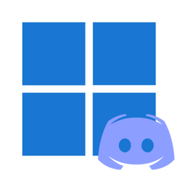
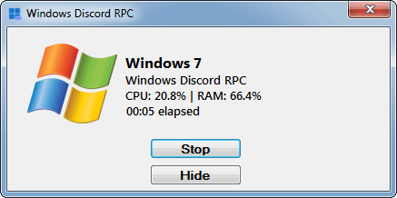

 Windows Discord RPC
=======================

[]

## Features

- Start/Stop the RPC.
- Hide Application Window.
- Quick notification area interaction menu.
- Display current windows title, CPU and RAM usage, elapsed time as Discord RPC.

## Development

- Language: C# 7.3
- SDK: .NET Framework 4.6.1
- IDE: Visual Studio Community 2019

## Build

1. Clone the repository.
2. Open the repository in VS2019, and build the solution.

## Downloads

Download from [releases](https://github.com/Glitcher85/WindowsDiscordRPC/releases).

## Supported Operating Systems

- Windows 7
- Windows 8
- Windows 10
- Windows 11

## Preview

